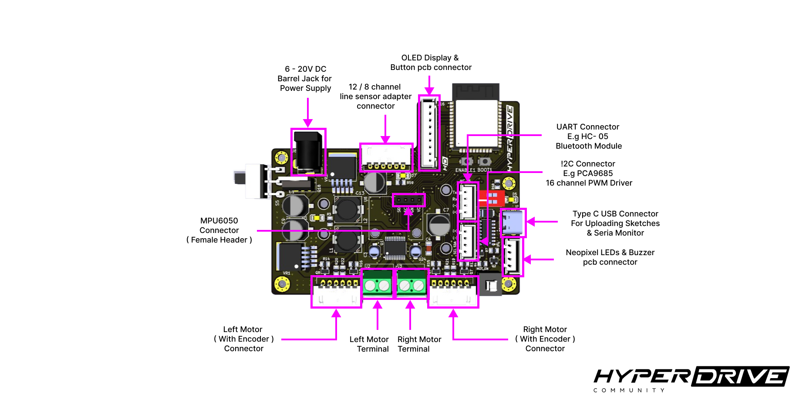
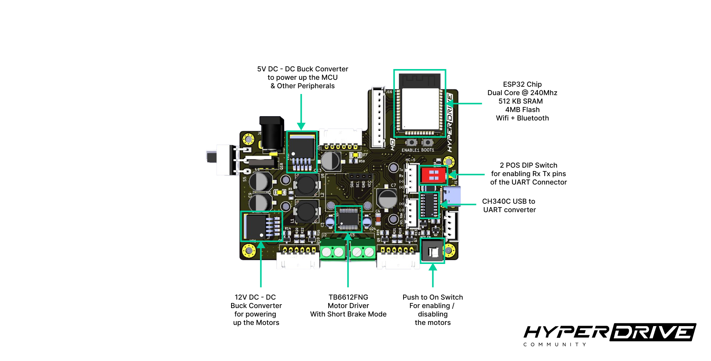
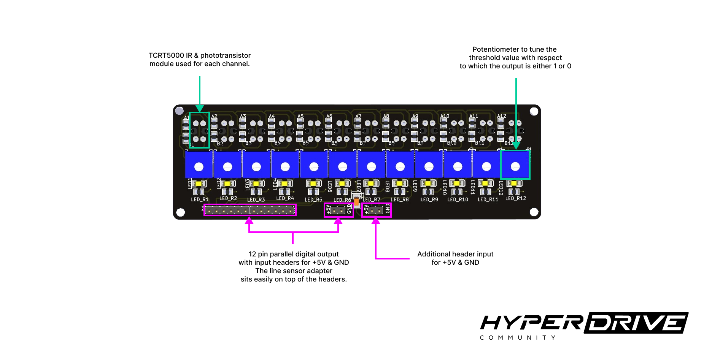
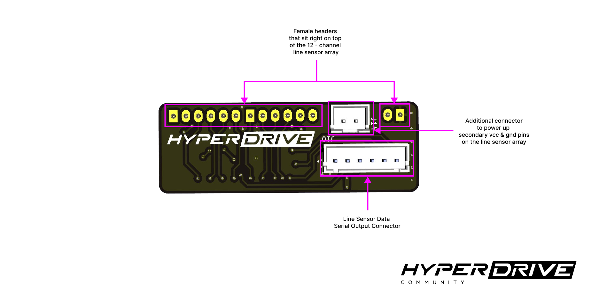
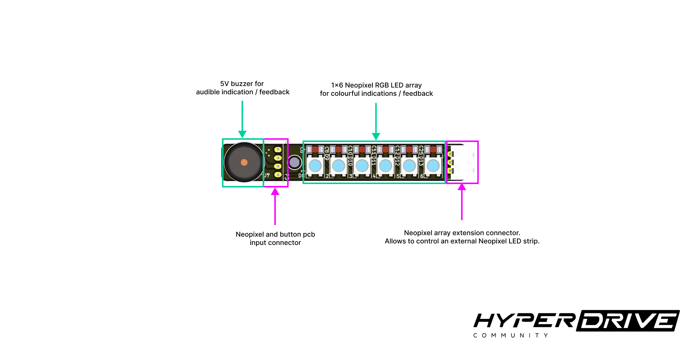
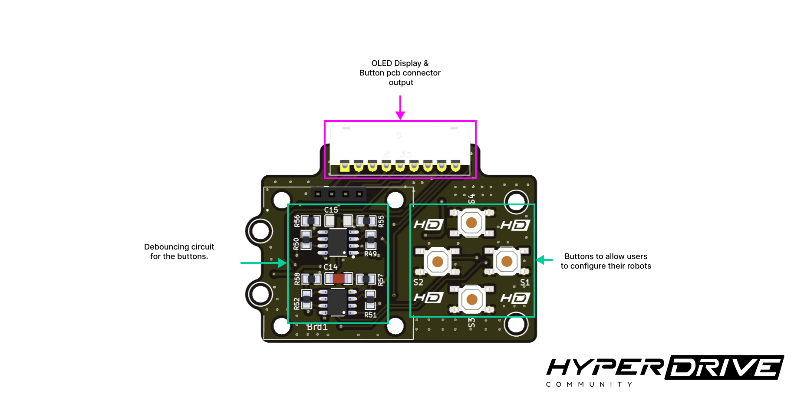

<div align="center"> 
     
</div>

</br>

# Glider v1.0

The first version of the Glider board series. A versatile, ESP32 powered, robot control board that allows one to build amazing robots. This board comes along with other components in form of a kit.

Apart from the roboboard, the other components include :

* [12 channel Line Sensor Array](#12-channel-line-sensor-array)
* [Parallel to Serial adapter for Line Sensor Array](#parallel-to-serial-adapter-for-line-sensor-array)
* [Neopixel Array & Buzzer board](#neopixel-array--buzzer-board)
* [OLED based GUI board](#oled-based-gui-board)

One of the common applications of this kit is Line Follower / Maze Solver robot. Apart from the components mentioned above, the kit also includes the necessary JST cables for enabling connectivity between the boards.

## The Roboboard 

<br/>

<p align="center">
    
</p>

<br/>

<p align="center">
    
</p>

<br/>

Like most roboboards, the Glider v1.0 board too has a microcontroller and a motor driver However, this board has a lot more than just two of these components. Following are the core features of the roboboard : 

### 1. Wide range power supply 

this roboard has two buck converters : 12V and 5V. This way the board can be powered by upto 20V via the DC barrel jack.

### 2. USB Type C connectivity 

Unlike most arduino boards, like uno and nano, this has a type C USB connector for uploading the code to ESP32 and serial monitoring.

### 3. Mosfet based TB6612FNG motor driver

known for it's efficiency and decent current output of 1.2A per channel (continous & 3A peak), this board Has the widely used Tb6612fng motor driver integrated on board.

### 4. Encoder Motor Connectivity 

besides scew terminal blocks for controlling two independently running DC motors, the board has two connectors for motors with encoders. ***It's important to note that the first two pins of the connector (close to the terminal blocks) are connected to the screw terminals***.

### 5. Connectivity for MPU6050 

besides having encoders for obtaining odomentry data, the robot may need an IMU for better position estimation. The roboboard has a connectivity for an MPU6050, positioned in a way that the IMU is present at the center.

### 6. Connectivity for HC-05

ESP32 has an inbuilt WiFi and Bluetooth connectivity, however this communication is managed by the code. Such wireless connections may fail to persist after the micrcocontroller resets. To enble wireless debugging over bluetooth, the roboboard has the connectivity for an external module like the HC-05.

### 7. Neopixels (WS2812B RGB LED) array with buzzer 

most robots have to indicate the occurence of an event like detecting a checkpoint ( in case of a line follower ) or detecting a valid intersection ( in case of a maze solvinf robot). The kit comes along with a pcb strip which includes an array of 6 WS2812B leds and a buzzer for unique audio and visual indications.

### 8. Additional Connectivity for I2C based devices  

many projects may require the board to interface with external I2C based peripherals like sensors & motors controllers. Once such example could be PCA9685 for controlling multiple servo motors. Thus projects like a hexapod or a bipedal humanoid robot can also be built using this roboboard.

### 9. 3.3V to 5V transaltion  

Circuitry for conversion of logic level from 3.3v to 5v and vice-versa exists. All the pins the ESP32 board are connected to MOSFET based logic level converters / translators for safe interfaction with 5V logic level devices.

### 10.  GUI board with OLED display connectivity 

The kit includes a GUI board with 4 smd button arranged in Top, Left, Right & Bottom configuration. The board also includes the debouncing circuitry for each of the 4 buttons. Besides, the GUI board has a connectivity for a 0.96" OLED display, hence providing a GUI setup for users to make necessary configurations on the robot dynamically.   

### 11. Easy Motor Driver Control  

The board has a push to On / Off switch for enabling / disabling the motor driver. The TB6612FNG has a STBY pin that allows it to be enabled / disabled by applying +5V digital logic ( 1 or 0). This pin is connected to +5V via a push to on / off switch that haults the motors without affecting the microcontroller's operation and powering off the entire board. This feature comes handy in many scenarious specially in case of a Line Follower Robot.  

### 12. Firm Connections to ensure reliabiity 

Unline most arduino based DIY projects, the use of Jumper / dupont wires may often lead to undesirable behavior as such connecting wires are prone to wearing out over multiple connections / disconnections. Japan Solderless Terminals (JST) connectors on the other hand are widely used in the industry, specially in most electronics based products due to their reliable nature. Leveraging this reliability and firm connectivity JST connectors are used throughout to allow firm connections as jumper wires are often fragile and wear out over time.

## Roboboard ESP32 pin allocation table

The following table describes which of the ESP32 GPIO pins are allocated to the onboard peripherals, however one can refer to the [Diagram based pinout](/Image_assets/roboboard_pinout.png) for convenience

|   ESP32 pin in ESP-IDF   |    Peripheral  |  3.3V to 5V Translation  |
|   ---------------------   |   ---------------------   |   ----------  |
<br/><span style="font-weight:bold;font-size:1.15em">Motor Driver (TB6612FNG)</span>
|   ```GPIO_NUM_26```  | AIN1 |     |
|   ```GPIO_NUM_25```  | AIN2 |     | 
|   ```GPIO_NUM_32```  | BIN2 |     |
|   ```GPIO_NUM_33```  | BIN1 |     |
|   ```GPIO_NUM_19```  | PWMA |     |
|   ```GPIO_NUM_18```  | PWMB |     |
<br/> <span style="font-weight:bold;font-size:1.15em">Line Sensor Adapter connectivity port</span>
|   ```GPIO_NUM_27```  | LOAD_PIN           |   | 
|   ```GPIO_NUM_4```   | CLOCK_ENABLE_PIN   |   |
|   ```GPIO_NUM_17```  | DATA_PIN           |   |
|   ```GPIO_NUM_16```  | CLOCK_PIN          |   |
<br/> <span style="font-weight:bold;font-size:1.15em">On board peripherals</span>
|   ```GPIO_NUM_2```   | BLUE_LED |  |
<br/> <span style="font-weight:bold;font-size:1.15em">Indication Board connectivity port</span>
|   ```GPIO_NUM_12```  | BUZZER             |   |
|   ```GPIO_NUM_23```  | NEOPIXEL_LED_PIN   |   |
<br/> <span style="font-weight:bold;font-size:1.15em">GUI Board connectivity port</span>
|   ```GPIO_NUM_36```  | BUTTON_LEFT    |    |        
|   ```GPIO_NUM_39```  | BUTTON_RIGHT   |    |       
|   ```GPIO_NUM_34```  | BUTTON_TOP     |    |       
|   ```GPIO_NUM_35```  | BUTTON_BOTTOM  |    |      
<br/> <span style="font-weight:bold;font-size:1.15em">Encoders port</span>
|   ```GPIO_NUM_15```  | LEFT_MOTOR_ENC_A   |   |
|   ```GPIO_NUM_5```   | LEFT_MOTOR_ENC_B   |   |
|   ```GPIO_NUM_13```  | RIGHT_MOTOR_ENC_A  |   |
|   ```GPIO_NUM_14```  | RIGHT_MOTOR_ENC_B  |   |
<br/> <span style="font-weight:bold;font-size:1.15em">I2C ports</span>
|   ```GPIO_NUM_21```  | SDA_PIN |  |
|   ```GPIO_NUM_22```  | SCL_PIN |  |
<br/> <span style="font-weight:bold;font-size:1.15em">UART0 ( Serial0 )</span>
|   ```GPIO_NUM_1```  | TXD_0   |    |
|   ```GPIO_NUM_3```  | RXD_0   |    |

<br/>

## 12 channel Line Sensor Array

<br/>

<p align="center">
    
</p>

<br/>

This sensor array has 12 individual sensors that output either +5V / 0V (digital 1 / 0) depending on how white / black the surface beneath the sensor is. The threshold above which the sensor outputs 1, is adjusted by the corresponding potentiometer. This way the Line sensor array outputs a 12 bit digital data.

Since the sensor ouputs 1 for a white surface and 0 for black surface, then sliding the sensor above a white line ( which is drawn above the black surface ), thick enough to cover 2 sensors, them the 12 bit output from the sensors looks something like : 

```
001100000000
000110000000
000011000000
000001100000
000000110000
000000011000
000000001100
```

## Parallel to Serial adapter for Line Sensor Array

A microcontroller may not have enough digital pins to read all the 12 bits of data from the line sensor array. This parallel output from the line sensor array must be converted to serial data such that the microcontroller can interface with the sensor using only a few pins. 
One such device for reading multiple inputs, using only 4 gpio pins of a microcontroller, is a shift register.  

For instance, an 8 bit shift regsiter, like 74HC165, can read upto 8 digital inputs. Hence for reading the 12 bit data from the line sensor array, at least two of these 8-bit shift registers will be required.
74HC165 shift registers have the ability to be cascaded with another shift register in a way that using only one data pin, a microcontroller can read data from all the shift registers. 

The adapter pcb houses two *daisy chained* shift registers and the serial output connector has the necessary pins that allows any microcontroller to read the Serial data. 
As shown in the [pinout](/Image_assets/adapter_pinout.png), the adapter outputs 16-bit data out of which 12 bits in the middle represent the digital output from the line sensor array and two bits from either side are dummy bits.


<br/>

<p align="center">
    
</p>

## Neopixel Array & Buzzer board

This board is a smalll pcb strip which has 6 WS2812B Neopixel RGB LEDs and a 5V buzzer. As shown in the [pinout](/Image_assets/indication_board_pinout.png), the connector with 4 pins acts as the input for the first neopixel leds and the buzzer. This board also has an output to extend the chain of LED array. Thus allowing an LED string to be connected with this board. However it is important to note that this board may have a limited ouput power. Thus limiting the number of LEDs that can be extended with this board.  

<br/>

<p align="center">
    
</p>

<br/>

## OLED based GUI board

A robot built with the Glider v1.0 may require configurations to made dynamically, in other words, configurations without re-uplaoding the firmware. Such frequent configurations can be made either wirelessly, or via an onboard GUI. This roboboard is capbale of implementing both the approach. However, an onboard GUI doesn't always require a persistent wireless connection.

This GUI board has 4 smd button which can help users to navigate through a menu, which can possibly be displayed on a SSD1306 OLED display. To ensure robustness and utilize the pcb-real estate, this board also includes required circuitry for button debouncing allowing interrupt based programs can run flawlessly.

On the left side of the pcb, female headers are present to allow SSD1306 based OLED displays to connect. Therefore this board serves most functionalities of a GUI board. Besides, the outline of this board is designed in such a way that it can be stacked up on the robobaord using 4 nuts, bolts, and spacers and connect with the roboboard via a 9 pin JST cable. Please check the [pinout](/Image_assets/gui_board_pinout.png) for the gui board connector.


<br/>

<p align="center">
    
</p>

<br/>

## Pinouts 

Following are the links to the images that describe each of the pins of the connectors on the respective boards : 

1. [Roboboard pinout](/Image_assets/roboboard_pinout.png)
2. [Line sensor adapter pinout](/Image_assets/adapter_pinout.png)
3. [Indication pinout](/Image_assets/indication_board_pinout.png)
4. [GUI board pinout](/Image_assets/gui_board_pinout.png)

## Projects 

Unlike most roboboards designed for specific project. The Glider v1.0 board allows users to build several other robots like : 
* Hexapod 
* Quadcopter
* Self-balancing robot

However, Line Following robots are the entry point to get started with robotics. The kit comes along with a 12 channel line sensor array which allows makers to build a Line Follower Robot. This repository contains the [source code for an LFR](/Code_examples/Glider_v1.0/PlatformIO_projects/Line_Follower_Robot/), as a platformIO project, and the same for other projects to get started.


